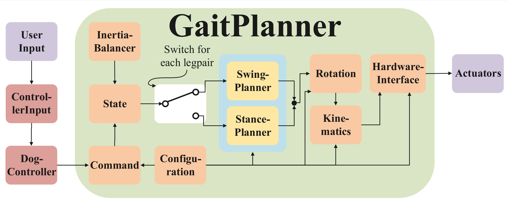

# AUTinyDane: Small Robotic Dog Development Project
Click the image below to see the robot walking:
[](https://youtu.be/1Trw5Afw9uk)


An open-source, affordable, and customizable 4-legged robotic dog. Originally developed as a 5th-semester project at the Department of Mechanical and Production Engineering at Aarhus University, this project covers the full development process from conceptual design to a finalized, functional quadruped.

## System Overview

AUTinyDane is designed to be highly accessible, operating on a unified, single-board architecture that handles all high-level planning and low-level execution in an open-loop configuration.



### Hardware Architecture
The robot operates entirely on a single-controller setup:
* **Main Controller:** Raspberry Pi running the full Python-based control stack.
* **Actuators:** Csl6336hv servos utilizing a unique custom bevel gear transmission. 
* **Chassis:** Hybrid construction utilizing laser-cut plywood and 3D-printed PLA/PETG components, validated through Finite Element Analysis (FEA) for structural integrity.

### Software Architecture
The pure Python software stack manages everything from user inputs to gait generation and hardware interfacing:
* **Kinematics:** Inverse Kinematics engine calculated entirely in Python (`Kinematics.py`). Optimal leg dimensions were mapped using an analytical solution.
* **Gait & Trajectory Planning:** Modular planners for different movement phases operating in an open-loop state machine (`GaitPlannerV2.py`, `StancePlannerV2.py`, `SwingPlannerV2.py`).
* **Hardware Interfacing:** Direct communication protocols for servo control (`HardwareInterface.py`).
* **Teleoperation:** Native PlayStation 4 controller support for real-time directional input and gait switching.

## Project Structure (Important Files)

```text
AUTinyDane/
├── src/                    # Core robot operational code
│   ├── Kinematics.py       # Inverse/Forward kinematics calculations
│   ├── HardwareInterface.py# Serial/I2C communication to Servos
│   ├── Configuration.py    # Physical dimensions and robot parameters
│   └── PS4Controller/      # DualShock 4 input mapping
├── legacy/                 # Original planning modules
│   ├── GaitPlanner.py      # Locomotion state machine and timing
│   ├── StancePlanner.py    # Stance phase calculations
│   ├── SwingPlanner.py     # Foot swing trajectory generation
│   └── gait_simulator.py   # Visualizer for gaits before physical deployment
├── tools/                  # Utility and calibration scripts
│   ├── calibrate_servos.py # Servo offset and range tuning
│   └── ServoNeutral.py     # Script to hold servos at neutral position
├── tests/                  # Module testing
│   └── Test_kinematics.py  # Validation for IK/FK models
├── run_robot.py            # Main execution script
└── requirements.txt        # Python package dependencies
```
## Installation

1. Clone the repository:
   ```bash
   git clone [https://github.com/jenslajordmunk/autinydane.git](https://github.com/jenslajordmunk/autinydane.git)
   cd autinydane

2. Install the required Python dependencies (it is recommended to use a virtual environment):
  ```bash
  pip install -r requirements.txt
```
## Run The robot
Remember to calibrate for the current assembly of the robot in src/ServoCalibratio.py, then:
Power on the Raspberry Pi system, connect the PS4 controller via Bluetooth, and execute the main loop:
 ```bash
  python run_robot.py
```
# Link to CAD Model:
[Link to CAD]([https://www.example.com](https://cad.onshape.com/documents/25850dd3366963afee831169/w/6267d7eaa6947084507654d8/e/b0a10a8a95fe9548e4d9bb0d))

#License
This project is licensed under the terms of the MIT License. See the LICENSE file for details.
